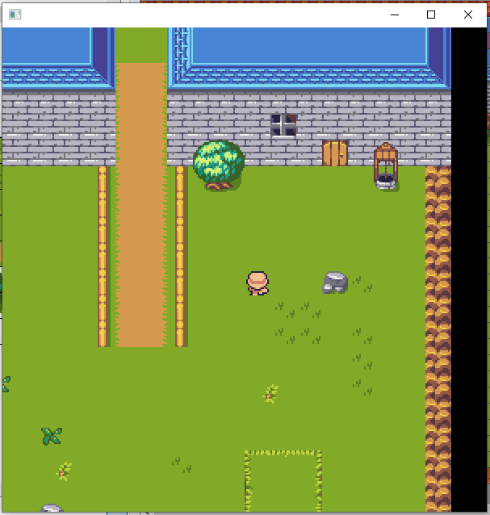
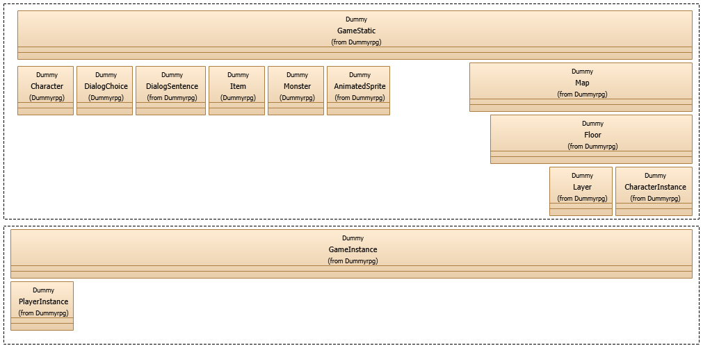
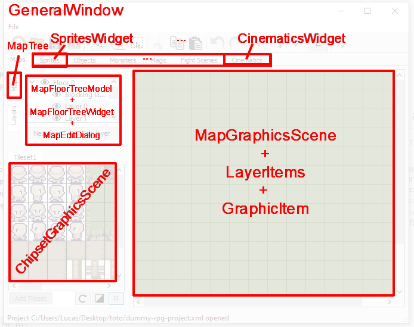

# DummyRPG - Editor

Welcome to DummyRPG project!

In this project you'll find:
* a simple 2D RPG game engine and its player  (https://github.com/PtiLuky/dummyRPG)
* an editor to create games for this editor ! (this repository)

The editor:

And a game preview:

## Current state

`¯\_(ツ)_/¯`

* [x] Draw a map, a floor
* [x] Select a sprite on a sprite sheet
* [ ] Set the position of the player
* [ ] Create the Non-player characters
* [ ] Create dialogs with NPC
* [ ] Spawn monsters
* [ ] Fights monsters
* [ ] Items management

Note: Player Client may be more avanced than the Editor. That'd mean that some functionnalities are
available in the client (let's say dialogs) but a game using them cannot be make
from this Editor yet.

## How to try DummyRPG?

You can find a .zip to extract and execute for **Windows only**:
* [Go to the Releases page](https://github.com/PtiLuky/dummyeditor/releases/) to find the last release. Download **dummyEditorWindows.zip**.
* Extract it somewhere
* Run dummyeditor.exe
  * If an error occures, try install VC runtime by running **vc_redist.x64.exe** before and then try again to run dummyeditor.exe

For other platerforms you will have to build it from sources, see below "Install from sources".
|  Platerform | build from source  | install from exe  |
|:-:|:-:|:-:|
| Linux  |  **Yes** |  not planned |
| Windows  | **Yes**  |  **Yes** |
| Mac  |  (Unknown) | not planned  |

## How to contribute and what to do?

Check out the [Contributing guide](https://github.com/PtiLuky/dummyRPG/blob/master/doc/contributing.md).
Don't hesistate to come on our [Discord server](https://discord.gg/qzx4AjT) !

All help is welcome :)

Some technical documents can be found in /docs to help you handle the code.  
Eg. ,  ...

## Install from sources

Tools:
* Qt (for editor UI)
* SFML (for player client UI)
* CMake (for building)

An [installation guide](docs/Installation_Windows-en.md) (available in [french](docs/Installation_Windows-fr.md)) has been written. Procedure for Linux is
quite similar. Please tell us on [Discord](https://discord.gg/qzx4AjT) if you need help for Linux installation.
